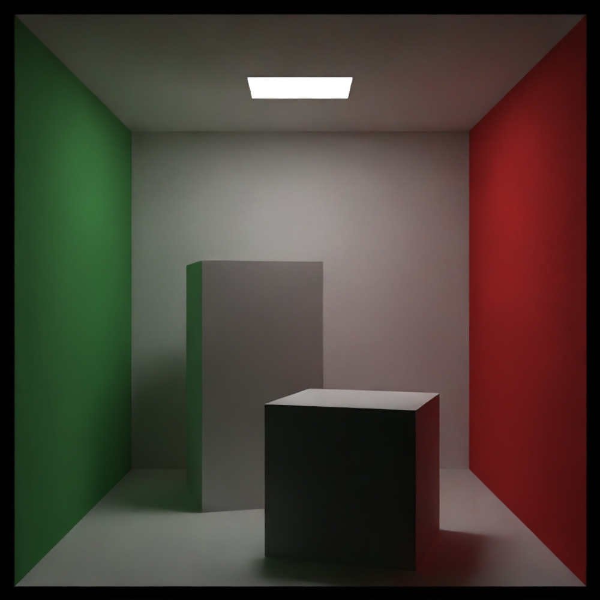

# CudaTracer

[](https://github.com/JasperJeuken/CudaRayTracer)
[](https://jasperjeuken.github.io/CudaRayTracer/)

A path tracing engine that uses C++ CUDA for rendering on the GPU.

_This is a personal project to learn about CUDA programming and is not optimized_


_Render preview window (sped-up)_

Documentation can be accessed [here](https://jasperjeuken.github.io/CudaRayTracer/).

## Features
- **Monte Carlo ray tracing**: high quality rendering using stochastic sampling
- **Rendering**:
  - **GPU acceleration**: parallel rendering using CUDA on (NVIDIA) GPUs
  - **Live preview**: (optional) preview with render progress using OpenGL/SDL2
  - **Render passes**: separate passes for post-processing (color, albedo, normal, depth, opacity, emission)
- **Image denoising**: (optional) denoising using Intel OpenImageDenoise.
- **Scene definition**: easy-to-use using YAML files
- **Environment textures**: supports (HDR) textures for image-based lighting.
- **Bounding Volume Hierarchy**: faster ray-scene intersection using BVH4.

## Gallery

A collection of some scenes rendered using the engine. The following images were rendered on an NVIDIA GTX 1070.

The scene definitions for all renders are available in [examples](examples/).

### Orthographic scene

| 1000 x 1000 px | 50 samples | 10 bounces | 0.130 seconds | denoised |
|----------------|------------|------------|---------------|----------|


| Raw pass (not denoised)                     | Albedo pass                                  | Emission pass                                  |
|---------------------------------------------|----------------------------------------------|------------------------------------------------|
|  |  |  |

| Normal pass                                  | Depth pass                                  | Opacity pass                                  |
|----------------------------------------------|---------------------------------------------|-----------------------------------------------|
|  |  |  |

### Cornell Box

| 1000 x 1000 px | 50 samples | 15 bounces | 4.843 seconds | denoised |
|----------------|------------|------------|---------------|----------|



### Normal map

Texture: [Red brick (2K)](https://polyhaven.com/a/red_brick)

| 1000 x 1000 px | 300 samples | 10 bounces | denoised |
|----------------|-------------|------------|----------|

| Without normal map                                 | With normal map                                 |
|----------------------------------------------------|-------------------------------------------------|
| 0.741 seconds                                      | 1.017 seconds                                   |
|         |         |
|  |  |

### HDR

HDR: [The Sky Is On Fire (2K)](https://polyhaven.com/a/the_sky_is_on_fire)

| 1000 x 1000 px | 100 samples | 5 bounces | 0.164 seconds | denoised |
|----------------|------------|------------|---------------|----------|


### Materials

Texture: [Aerial Beach 03](https://polyhaven.com/a/aerial_beach_03)

| 2000 x 400 px | 100 samples | 30 bounces | 2.472 seconds |
|----------------|------------|------------|---------------|

Raw:


Denoised:


Left to right: checker, glass, matte, image, metal, brushed metal

## Dependencies
Before building this project, the following dependencies are required:

- [`CUDA Toolkit`](https://developer.nvidia.com/cuda-toolkit): compiling and running CUDA code
- [`SDL2`](https://www.libsdl.org/): preview window
- [`OpenGL`](https://www.opengl.org/): preview window
- [`GLEW`](https://glew.sourceforge.net/): preview window
- [`yaml-cpp`](https://github.com/jbeder/yaml-cpp): YAML parsing
- [`OpenImageDenoise`](https://github.com/RenderKit/oidn): image denoising

The following header-only libraries are included in the repository (in [`external/`](external)):

- [`glText`](https://github.com/vallentin/glText): text in preview window
- [`stb`](https://github.com/nothings/stb): image loading/saving (`image` and `image_write`)

## Build Instructions
To build the application, use the following steps:

1. Clone the repository:
   ```bash
   git clone https://github.com/JasperJeuken/CudaRayTracer.git
   cd CudaRayTracer
   ```
2. Create a build directory and configure the project:
   ```bash
   mkdir build
   cd build
   cmake ..
   ```
3. Build the project:
   ```bash
   cmake --build . --config Release
   ```
4. Run the application:
   ```bash
   cd ..
   ./dist/Release/CudaTracer.exe scene.yaml
   ```

## Quick Usage
1. **Scene definition**  
  Before rendering anything, a scene with objects, camera properties, and render settings needs to be defined. A YAML file is used for this. Several example definitions are included in the [`examples/`](examples) directory in the repository.   
  Here is an example definition:
   ```yaml
   camera:
     type: perspective
     from: [-4, 0, 0]
     to: [0, 0, 0]
     vfov: 30
   
   render:
     width: 1000
     height: 1000
     samples: 100
     max_bounces: 30

   environment:
     texture:
       type: solid_color
       color: [0.9, 0.9, 0.9]


   textures:
     - name: solid_black
       type: solid_color
       color: [0.1, 0.1, 0.1]
   
   materials:
     - name: black
       type: lambertian
       texture: solid_black

   objects:
     - type: sphere
       center: [0, 0, 0]
       radius: 1
       material: black
   ```
   This will be a scene with a single black sphere in a white environment.  
   More detailed options are specified in [this section](#scene-options).
2. **Rendering**  
  To render a scene, build the executable and specify your YAML file when running it:
   ```bash
   ./dist/Release/CudaTracer.exe examples/basic.yaml
   ```
   This will load your scene and start the render with a preview window. When it is done, all render passes will be saved to `./output/YYYYMMDD_HHMMSS/` by default.  
   There are multiple additional arguments you can use to change the behaviour of the program, see [this section](#command-line-options) for more details.

## Scene options
The scene file defines the following elements:
- Camera
- Render settings
- Environment
- Textures (optional, can be in-line)
- Materials (optional, can be in-line)
- Objects

Below, all options are detailed.


### Camera settings
There are two main camera types: `perspective` and `orthographic`. The first mimics a real-life camera, while the second keeps objects at the same size regardless of distance to the camera.

| **Option**      | **Type** | **Default** | **Description**                                            |
|-----------------|----------|-------------|------------------------------------------------------------|
| `type`          | string   | N/A         | Type of camera (`perspective` or `orthographic`)           |
| `from`          | vec3     | N/A         | Camera position                                            |
| `to`            | vec3     | N/A         | Camera target                                              |
| `up`            | vec3     | [0, 1, 0]   | Up direction                                               |
| `vfov`          | float    | N/A         | [`perspective` only] vertical field-of-view (degrees)        |
| `defocus_angle` | float    | 0.0         | [`perspective` only] angle variation through pixel (degrees) |
| `focus_dist`    | float    | 10.0        | [`perspective` only] distance to focus plane                 |
| `width`         | float    | N/A         | [`orthographic` only] width of projection plane              |

Perspective example:
```yaml
camera:
  type: perspective
  from: [-2, 0, 0]
  to: [0, 0, 0]
  up: [0, 1, 0]
  vfov: 20.0
  defocus_angle: 1
  focus_dist: 2
```
Orthographic example:
```yaml
camera:
  type: orthographic
  from: [-2, 0, 0]
  to: [0, 0, 0]
  width: 4
```

### Render settings
These settings dictate the image size and quality of the render. The number of samples describes how many rays are "shot" through each pixel which improves accuracy and adds anti-aliasing.

| **Option**    | **Type** | **Default** | **Description**                                         |
|---------------|----------|-------------|---------------------------------------------------------|
| `width`       | int      | N/A         | Width of the image (pixels)                             |
| `height`      | int      | N/A         | Height of the image (pixels)                            |
| `samples`     | int      | N/A         | Number of samples per pixel                             |
| `max_bounces` | int      | 50          | Maximum amount of times a ray can bounce from a surface |
| `gamma`       | float    | 2.0         | Gamma-correction factor                                 |

Example:
```yaml
render:
  width: 2000
  height: 1000
  samples: 100
  max_bounces: 30
  gamma: 2.0
```

### Textures
Textures specify the color of a material at a given point. The software currently supports three different texture types: `solid_color`, `checker`, and `image`. The solid color texture is simply a single color at all points. The checker texture combines two other textures in a checkered pattern, with one even and one odd texture. Finally, the image texture loads an image from disk. Each come with different settings.

| **Option**  | **Type** | **Default** | **Description**                                                  |
|-------------|----------|-------------|------------------------------------------------------------------|
| `type`      | string   | N/A         | Type of texture (`solid_color`, `checker`, or `image`)           |
| `name`      | string   | -           | Optional name of texture (allows texture to be referenced later) |
| `color`     | vec3     | N/A         | [`solid_color` only] solid color (rgb)                           |
| `odd`       | texture  | N/A         | [`checker` only] odd checker texture                             |
| `even`      | texture  | N/A         | [`checker` only] even checker texture                            |
| `scale`     | float    | 1.0         | [`checker` only] checker pattern scale                           |
| `filename`  | string   | N/A         | [`image` only] (relative) path to image file                     |
| `hdr_gamma` | float    | 2.2         | [`image` only] gamma-correction for HDR files                    |
| `hdr_scale` | float    | 1.0         | [`image` only] scale correction for HDR files                    |
| `channels`  | int      | 0           | [`image` only] Number of image components (`0=auto`)             |
| `flip_y`    | bool     | false       | [`image` only] Whether to vertically flip the image              |

Textures can be named such that they can be referenced in other parts of the YAML file. In the examples below, a solid color texture `red` is created first. Then, in the checker texture `red_green`, it is referenced as the odd texture, while the even texture is created in-line.

Solid color example:
```yaml
textures:
  - name: solid_red
    type: solid_color
    color: [1, 0, 0]
```

Checker example:
```yaml
...
 - name: red_green_checker
   type: checker
   odd: solid_red
   even:
     type: solid_color
     color: [0, 1, 0]
   scale: 0.5
```

Image example:
```yaml
...
  - name: brick_texture
    type: image
    filename: assets/textures/red_brick/diff_4k.jpg
    flip_y: true
```

### Materials
Materials define the optical properties of an object. It determines how rays interact with the object, for example through diffusion, reflection, or refraction. There are four materials: `lambertian`, `metal`, `dielectric`, `diffuse_light`. A Lambertian material is a ideal diffuse material. The metal material is reflective, with an optional setting to make it more diffuse. A dielectric material reflects or refracts a ray depending on the incidence angle and index of refraction, an example is glass. Finally, a diffuse light emits colored light.

| **Option** | **Type** | **Default** | **Description**                                                            |
|------------|----------|-------------|----------------------------------------------------------------------------|
| `type`     | string   | N/A         | Type of material (`lambertian`, `metal`, `dielectric`, or `diffuse_light`) |
| `name`     | string   | -           | Optional name of material (allows material to be referenced later)         |
| `texture`  | texture  | N/A         | [`lambertian`/`diffuse_light` only] material texture                       |
| `color`    | vec3     | N/A         | [`metal` only] metal tint color                                            |
| `fuzz`     | float    | 0.0         | [`metal` only] metal fuzziness (brushed metal)                             |
| `ior`      | float    | 1.5         | [`dielectric` only] index of refraction                                    |

Lambertian example:
```yaml
materials:
  - name: red
    type: lambertian
    texture: solid_red
    # or in-line
    texture:
      type: solid_color
      color: [1, 0, 0]
```

Metal example:
```yaml
...
  - name: mirror
    type: metal
    color: [1, 1, 1]
    fuzz: 0
```

Dielectric example:
```yaml
...
  - name: glass
    type: dielectric
    ior: 1.5
```

Diffuse light example:
```yaml
...
  - name: light
    type: diffuse_light
    texture:
      type: solid_color
      color: [1, 1, 1]
```

### Objects
Objects define the shapes present in the scene. There are five basic shapes available: `sphere`, `uv_sphere`, `tri`, `quad`, and `box`. The sphere is a perfect mathematical sphere defined by a center and radius. A UV sphere is an approximation of a sphere using triangles. Triangles can also be defined by themselves, or two triangles forming a quadrilateral. Finally, multiple quadrilaterals can be assembled into a box.

There are additional options to translate or rotate objects.

| **Option**     | **Type** | **Default** | **Description**                                                                        |
|----------------|----------|-------------|----------------------------------------------------------------------------------------|
| `type`         | string   | N/A         | Type of object (`sphere`, `uv_sphere`, `tri`, `quad`, `box`, `translate`, or `rotate`) |
| `material`     | material | N/A         | Material of the object (not for `rotate` or `translate`)                               |
| `normal`       | texture  | -           | Optional normal texture (DirectX format, not for `rotate` or `translate`)              |
| `center`       | vec3     | N/A         | [`sphere`/`uv_sphere` only] sphere center                                              |
| `radius`       | float    | N/A         | [`sphere`/`uv_sphere` only] sphere radius                                              |
| `center2`      | vec3     | center      | [`sphere` only] if defined, sphere moves between two points with motion blur           |
| `rings`        | int      | 5           | [`uv_sphere` only] number of rings (horizontal)                                        |
| `segments`     | int      | 10          | [`uv_sphere` only] number of segments (vertical)                                       |
| `shade_smooth` | bool     | false       | [`uv_sphere` only] whether to smooth edges using vertex normals                        |
| `v0`           | vec3     | N/A         | [`tri` only] First vertex                                                              |
| `v1`           | vec3     | N/A         | [`tri` only] Second vertex                                                             |
| `v2`           | vec3     | N/A         | [`tri` only] Third vertex                                                              |
| `uv0`          | vec2     | [0, 1]      | [`tri` only] UV-coordinates of first vertex                                            |
| `uv1`          | vec2     | [1, 0]      | [`tri` only] UV-coordinates of second vertex                                           |
| `uv2`          | vec2     | [0, 0]      | [`tri` only] UV-coordinates of third vertex                                            |
| `corner`       | vec3     | N/A         | [`quad` only] Corner point                                                             |
| `edge1`        | vec3     | N/A         | [`quad` only] First edge direction                                                     |
| `edge2`        | vec3     | N/A         | [`quad` only] Second edge direction                                                    |
| `corner1`      | vec3     | N/A         | [`box` only] First box corner point                                                    |
| `corner2`      | vec3     | N/A         | [`box` only] Second box corner point                                                   |
| `object`       | object   | N/A         | [`translate`/`rotate` only] object to translate/rotate                                 |
| `offset`       | vec3     | N/A         | [`translate` only] translation vector (xyz)                                            |
| `angles`       | vec3     | N/A         | [`rotate` only] rotation angles (xyz, degrees)                                         |
| `anchor`       | vec3     | center      | [`rotate` only] point about which to rotate (default is object center point)           |

Sphere example:
```yaml
objects:
  - type: sphere
    center: [0, 0, 0]
    radius: 1
    material: red
    # or in-line
    material:
      type: lambertian
      texture:
        type: solid_color
        color: [1, 0, 0]
```

UV sphere example:
```yaml
...
  - type: uv_sphere
    center: [0, 0, 0]
    radius: 1
    rings: 10
    segments: 20
    shade_smooth: true
    material: mirror
```

Triangle example:
```yaml
...
  - type: tri
    v0: [0, 0, 0]
    v1: [0, 1, 1]
    v2: [0, 1, 0]
    material: light
```

Quad example:
```yaml
...
  - type: quad
    corner: [0, 0, 0]
    edge1: [1, 0, 0]
    edge2: [0, 1, 0]
    material: red
```

Box example:
```yaml
...
  - type: box
    corner1: [0, 0, 0]
    corner2: [1, 1, 1]
    material: red
```

Translate example:
```yaml
...
  - type: translate
    offset: [-1, -1, 0]
    object:
      type: sphere
      center: [0, 0, 0]
      radius: 1
      material: red
```

Rotate example:
```yaml
...
  - type: rotate
    angles: [30, 10, 0]
    object:
      type: box
      corner1: [0, 0, 0]
      corner2: [1, 1, 1]
      material: red
    anchor: [0, 0, 0]
```

### Environment
The final entry in the YAML file is the environment texture. This describes the color of the sky surrounding the scene.
```yaml
environment:
  texture: red
  # or in-line
  texture:
    type: image
    filename: assets/hdr/the_sky_is_on_fire_2k.hdr
    hdr_gamma: 2.2
    hdr_scale: 1
    flip_y: true
```

## Command-line options
The engine can be called with optional arguments. It contains the following options:

| **Argument**            | **Description**                                                       | **Example**          |
|-------------------------|-----------------------------------------------------------------------|----------------------|
| `-s <file>`             | (required) Specifies path to the scene YAML file to render.           | -s examples/hdr.yaml |
| `--no-preview` or `-np` | Disables the preview window.                                          | --no-preview         |
| `-o <path>`             | Specifies output directory path. Default: `output/<current_datetime>` | -o result/           |
| `-f <format>`           | Specifies output image format (`png`, `jpg`, `bmp`, `tga`, or `hdr`)  | -f jpg               |
| `-p <passes>`           | Specifies which render passes to save. See below for more details. Default: `all`    | -p color,depth       |

Render passes can be specified as a comma-separated list of passes (e.g. `-p color,depth,normal`) or `all` for all passes. 

Specific passes can be excluded by prefixing `!` (e.g. `-p !opacity` to exclude the opacity pass).

Valid render passes include:
`color`, `albedo`, `emission`, `normal`, `depth`, `opacity`, and `denoised`.